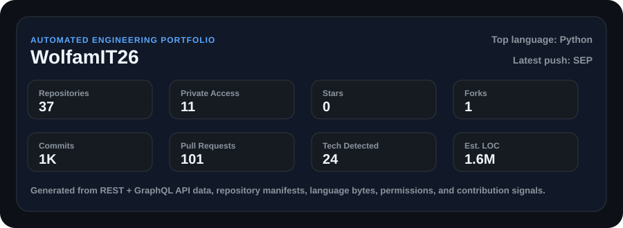
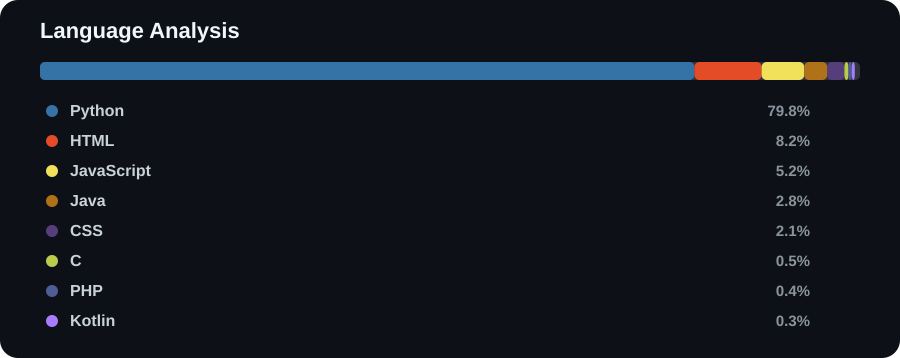
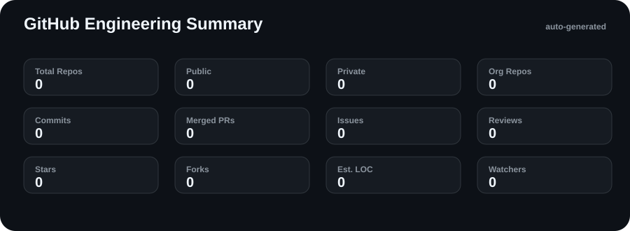
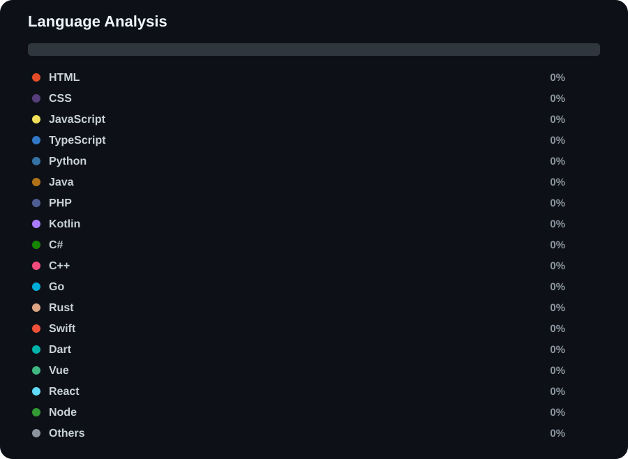
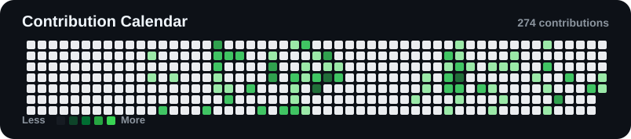

  
  <h1>Phạm Huy Đức Việt</h1>
  
<strong>@WolfamIT26</strong>

  
Program to succeed, connect to grow

  

    
    
    
    
    
  

## Portfolio Overview

  

## Tech Stack

  

  
  
  
  
  
  
  
  
  
  
  
  
  
  
  
  
  
  
  
  
  
  
  
  
  

## Latest Projects

### ✨ [WolfamIT26/github-profile-generator](https://github.com/WolfamIT26/github-profile-generator)

No description provided.

    
    
    
    
    
    
    
    
    

    

### ⚙️ [tutl0371/SEP](https://github.com/tutl0371/SEP)

No description provided.

    
    
    
    
    
    
    
    
    
    
    
    

    
    
    
    

    

### ⚙️ [Nhom-12-Laptrinhmang/gameGK](https://github.com/Nhom-12-Laptrinhmang/gameGK)

No description provided.

    
    
    
    
    
    
    
    
    
    
    
    
    

    

    

### ⚙️ [Nhom-12-Laptrinhmang/Example](https://github.com/Nhom-12-Laptrinhmang/Example)

No description provided.

    
    
    
    
    
    
    
    
    
    
    
    
    

    
    

    

### ⚙️ [Nhom-12-Laptrinhmang/GK](https://github.com/Nhom-12-Laptrinhmang/GK)

No description provided.

    
    
    
    
    
    
    
    
    
    
    
    
    

    
    
    
    
    

    

### ✨ [Nhom-12-Laptrinhmang/CK](https://github.com/Nhom-12-Laptrinhmang/CK)

No description provided.

    
    
    
    
    
    
    
    
    
    
    
    

    
    

    

### ✨ [Nhom-12-Laptrinhmang/E5](https://github.com/Nhom-12-Laptrinhmang/E5)

No description provided.

    
    
    
    
    
    
    
    
    
    
    
    

    
    
    

    

### ✨ [Nhom-12-Laptrinhmang/E5-Web](https://github.com/Nhom-12-Laptrinhmang/E5-Web)

No description provided.

    
    
    
    
    
    
    
    
    
    
    
    

    
    
    
    

    

## Language Analysis

  
  

    
    
    
    
    
    
    
    
  

## GitHub Stats

  
  
   
  <picture>
    <source srcset="https://streak-stats.demolab.com?user=WolfamIT26&theme=github-dark-blue&hide_border=true" media="(prefers-color-scheme: dark)" />
    
  </picture>
   
  <picture>
    <source srcset="https://github-readme-activity-graph.vercel.app/graph?username=WolfamIT26&theme=github-dark&hide_border=true" media="(prefers-color-scheme: dark)" />
    
  </picture>
   
  
   
  

## Organizations

  
No public organizations were found.

  README generated automatically from the GitHub API for <a href="https://github.com/WolfamIT26">@WolfamIT26</a>.

